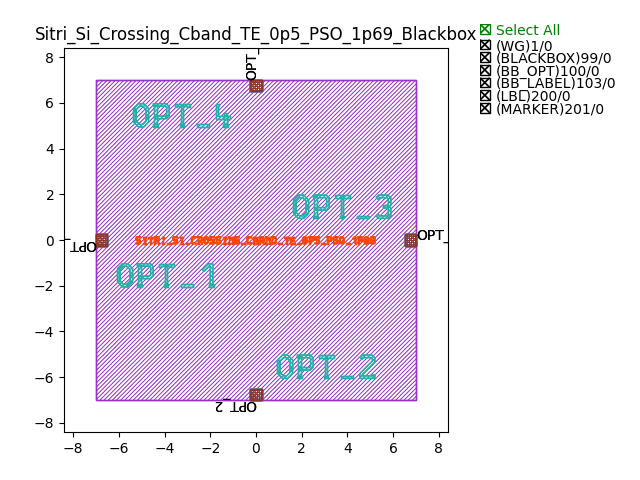
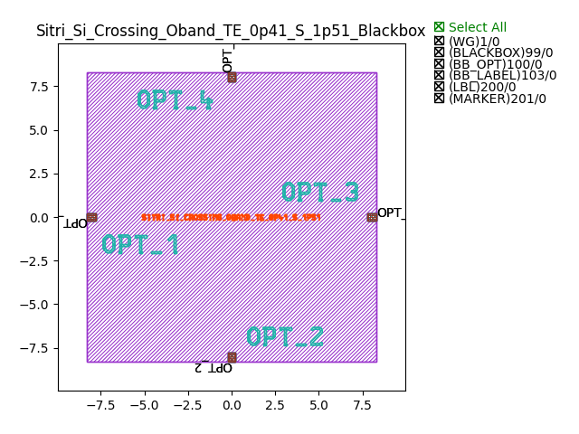

Crossings
###########

Sitri_Si_Crossing_Cband_TE_0p5_PSO_1p69_Blackbox
******************************************************

+-------+------------------------+-------------+
| ports |     waveguide type     | orientation |
+=======+========================+=============+
|OPT_1  | TECH.WG.STRIP.C.WIRE   |     180     |
+-------+------------------------+-------------+
|OPT_2  | TECH.WG.STRIP.C.WIRE   |      -90    |
+-------+------------------------+-------------+
| OPT_3 | TECH.WG.STRIP.C.WIRE   |     0       |
+-------+------------------------+-------------+
| OPT_4 | TECH.WG.STRIP.C.WIRE   |      90     |
+-------+------------------------+-------------+

Sitri_Si_Crossing_Oband_TE_0p41_S_1p51_Blackbox
********************************************************

+-------+------------------------+-------------+
| ports |     waveguide type     | orientation |
+=======+========================+=============+
|OPT_1  | TECH.WG.STRIP.O.WIRE   |     180     |
+-------+------------------------+-------------+
|OPT_2  | TECH.WG.STRIP.O.WIRE   |      -90    |
+-------+------------------------+-------------+
| OPT_3 | TECH.WG.STRIP.O.WIRE   |     0       |
+-------+------------------------+-------------+
| OPT_4 | TECH.WG.STRIP.O.WIRE   |      90     |
+-------+------------------------+-------------+

