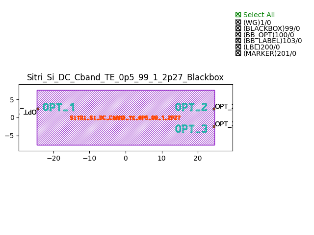
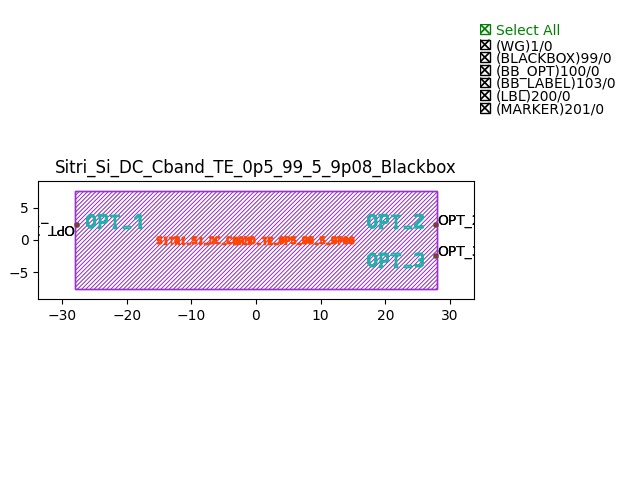
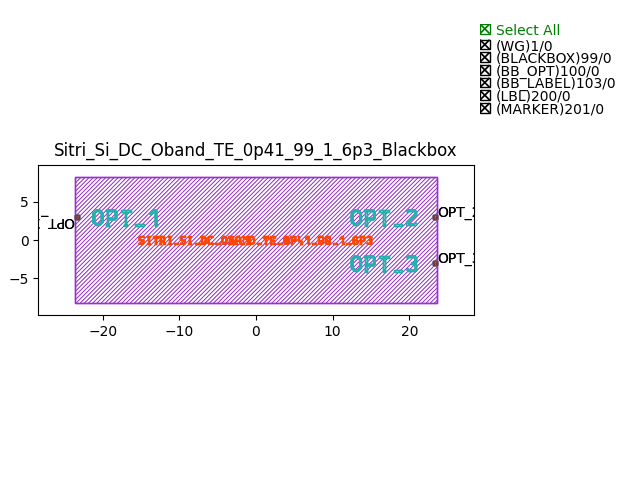

Directional Couplers (DC)
################################

Sitri_Si_DC_Cband_TE_0p5_99_1_2p27_Blackbox
************************************************

+-------+-----------------------------+-------------+
| ports |     waveguide type          | orientation |
+=======+=============================+=============+
|  in1  | TECH.WG.Channel.C.WIRE      |     180     |
+-------+-----------------------------+-------------+
|  in2  | TECH.WG.Channel.C.WIRE      |      180    |
+-------+-----------------------------+-------------+
| out1  | TECH.WG.Channel.C.WIRE      |     0       |
+-------+-----------------------------+-------------+
| out2  | TECH.WG.Channel.C.WIRE      |      0      |
+-------+-----------------------------+-------------+

Sitri_Si_DC_Cband_TE_0p5_99_5_9p08_Blackbox
************************************************

+-------+-----------------------------+-------------+
| ports |     waveguide type          | orientation |
+=======+=============================+=============+
|  in1  | TECH.WG.Channel.C.WIRE      |     180     |
+-------+-----------------------------+-------------+
|  in2  | TECH.WG.Channel.C.WIRE      |      180    |
+-------+-----------------------------+-------------+
| out1  | TECH.WG.Channel.C.WIRE      |     0       |
+-------+-----------------------------+-------------+
| out2  | TECH.WG.Channel.C.WIRE      |      0      |
+-------+-----------------------------+-------------+

Sitri_Si_DC_Oband_TE_0p41_95_5_20p7_Blackbox
************************************************
.. image:: ../images/Sitri_Si_DC_Oband_TE_0p41_95_5_20p7_Blackbox.png

+-------+-----------------------------+-------------+
| ports |     waveguide type          | orientation |
+=======+=============================+=============+
|  in1  | TECH.WG.Channel.C.WIRE      |     180     |
+-------+-----------------------------+-------------+
|  in2  | TECH.WG.Channel.C.WIRE      |      180    |
+-------+-----------------------------+-------------+
| out1  | TECH.WG.Channel.C.WIRE      |     0       |
+-------+-----------------------------+-------------+
| out2  | TECH.WG.Channel.C.WIRE      |      0      |
+-------+-----------------------------+-------------+

Sitri_Si_DC_Oband_TE_0p41_99_1_6p3_Blackbox
************************************************

+-------+-----------------------------+-------------+
| ports |     waveguide type          | orientation |
+=======+=============================+=============+
|  in1  | TECH.WG.Channel.C.WIRE      |     180     |
+-------+-----------------------------+-------------+
|  in2  | TECH.WG.Channel.C.WIRE      |      180    |
+-------+-----------------------------+-------------+
| out1  | TECH.WG.Channel.C.WIRE      |     0       |
+-------+-----------------------------+-------------+
| out2  | TECH.WG.Channel.C.WIRE      |      0      |
+-------+-----------------------------+-------------+

