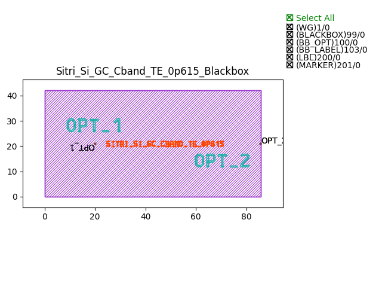
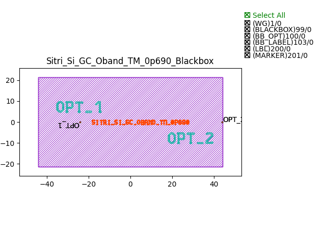

Grating Couplers (GC)
#############################

Sitri_Si_GC_Cband_TE_0p615_Blackbox
****************************************

+-------+-----------------------------+-------------+
| ports |     waveguide type          | orientation |
+=======+=============================+=============+
| out1  | TECH.WG.Channel.C.WIRE      |       0     |
+-------+-----------------------------+-------------+

Sitri_Si_GC_Cband_TM_0p925_Blackbox
******************************************

+-------+-----------------------------+-------------+
| ports |     waveguide type          | orientation |
+=======+=============================+=============+
| out1  | TECH.WG.Channel.O.WIRE      |       0     |
+-------+-----------------------------+-------------+

Sitri_Si_GC_Oband_TE_0p495_Blackbox
******************************************

+-------+-----------------------------+-------------+
| ports |     waveguide type          | orientation |
+=======+=============================+=============+
| out1  | TECH.WG.Channel.O.WIRE      |       0     |
+-------+-----------------------------+-------------+

Sitri_Si_GC_Oband_TM_0p690_Blackbox
******************************************

+-------+-----------------------------+-------------+
| ports |     waveguide type          | orientation |
+=======+=============================+=============+
| out1  | TECH.WG.Channel.O.WIRE      |       0     |
+-------+-----------------------------+-------------+

