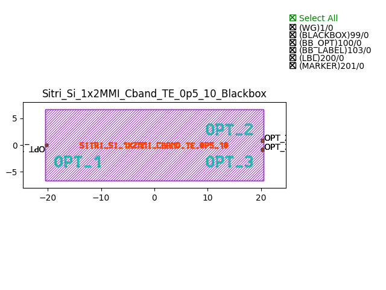
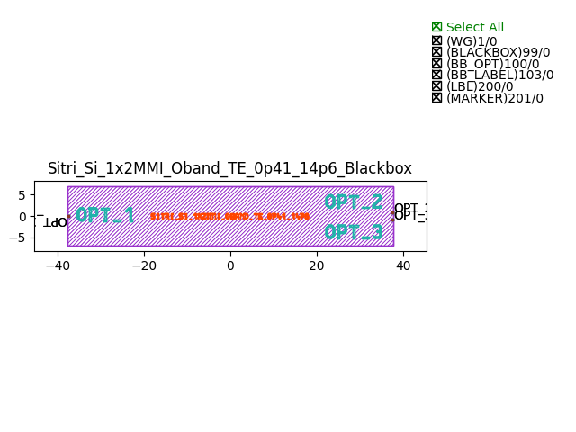
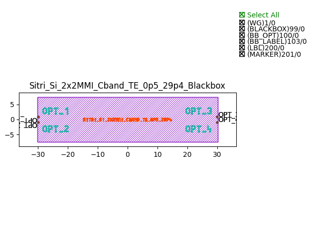

MultiMode Interferometers (MMI)
####################################

Sitri_Si_1x2MMI_Cband_TE_0p5_10_Blackbox
******************************************

+--------+-----------------------------+-------------+
| ports  |     waveguide type          | orientation |
+========+=============================+=============+
|in1     | TECH.WG.Channel.O.WIRE      |     180     |
+--------+-----------------------------+-------------+
| out1   | TECH.WG.Channel.O.WIRE      |        0    |
+--------+-----------------------------+-------------+
| out2   | TECH.WG.Channel.O.WIRE      |     0       |
+--------+-----------------------------+-------------+

Sitri_Si_1x2MMI_Oband_TE_0p41_14p6_Blackbox
***************************************************

+--------+-----------------------------+-------------+
| ports  |     waveguide type          | orientation |
+========+=============================+=============+
|in1     | TECH.WG.Channel.O.WIRE      |     180     |
+--------+-----------------------------+-------------+
| out1   | TECH.WG.Channel.O.WIRE      |        0    |
+--------+-----------------------------+-------------+
| out2   | TECH.WG.Channel.O.WIRE      |     0       |
+--------+-----------------------------+-------------+

Sitri_Si_2x2MMI_Cband_TE_0p5_29p4_Blackbox
***************************************************

+--------+-----------------------------+-------------+
| ports  |     waveguide type          | orientation |
+========+=============================+=============+
|in1     | TECH.WG.Channel.O.WIRE      |     180     |
+--------+-----------------------------+-------------+
| out1   | TECH.WG.Channel.O.WIRE      |        0    |
+--------+-----------------------------+-------------+
| out2   | TECH.WG.Channel.O.WIRE      |     0       |
+--------+-----------------------------+-------------+

Sitri_Si_2x2MMI_Oband_TE_0p41_54p2_Blackbox
***************************************************
.. image:: ../images/Sitri_Si_2x2MMI_Oband_TE_0p41_54p2_Blackbox.png

+--------+-----------------------------+-------------+
| ports  |     waveguide type          | orientation |
+========+=============================+=============+
|in1     | TECH.WG.Channel.C.WIRE      |     180     |
+--------+-----------------------------+-------------+
| out1   | TECH.WG.Channel.C.WIRE      |        0    |
+--------+-----------------------------+-------------+
| out2   | TECH.WG.Channel.C.WIRE      |     0       |
+--------+-----------------------------+-------------+

