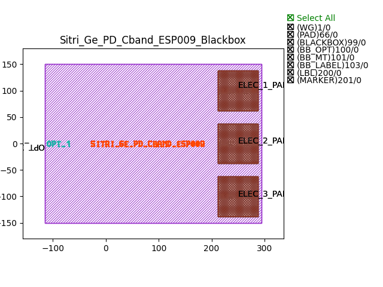
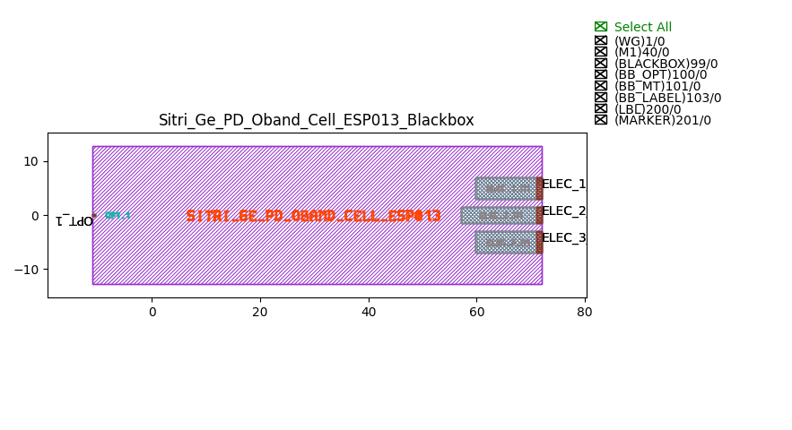
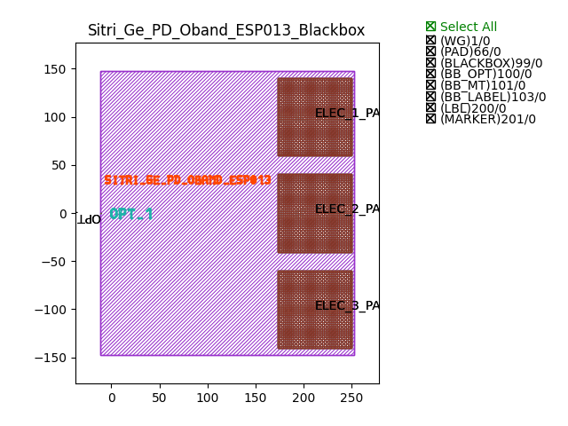

Photo-Detectors (PD)
########################

Sitri_Ge_PD_Cband_Cell_ESP009_Blackbox
********************************************
.. image:: ../images/Sitri_Ge_PD_Cband_Cell_ESP009_Blackbox.png

+-----------+-----------------------------+-------------+
| ports     |     waveguide type          | orientation |
+===========+=============================+=============+
|OPT_1      | TECH.WG.STRIP.C.WIRE        |     180     |
+-----------+-----------------------------+-------------+
|ELEC_1_M1  | TECH.METAL.M1               |     0       |
+-----------+-----------------------------+-------------+
|ELEC_2_M1  | TECH.METAL.M1               |    0        |
+-----------+-----------------------------+-------------+
|ELEC_3_M1  | TECH.METAL.M1               |     0       |
+-----------+-----------------------------+-------------+

Sitri_Ge_PD_Cband_ESP009_Blackbox
********************************************

+-----------+-----------------------------+-------------+
| ports     |     waveguide type          | orientation |
+===========+=============================+=============+
|OPT_1      | TECH.WG.STRIP.C.WIRE        |     180     |
+-----------+-----------------------------+-------------+
|ELEC_1_PAD | TECH.METAL.PAD              |     None    |
+-----------+-----------------------------+-------------+
|ELEC_2_PAD | TECH.METAL.PAD              |     None    |
+-----------+-----------------------------+-------------+
|ELEC_3_PAD | TECH.METAL.PAD              |     None    |
+-----------+-----------------------------+-------------+

Sitri_Ge_PD_Oband_Cell_ESP013_Blackbox
********************************************

+-----------+-----------------------------+-------------+
| ports     |     waveguide type          | orientation |
+===========+=============================+=============+
|OPT_1      | TECH.WG.STRIP.O.WIRE        |     180     |
+-----------+-----------------------------+-------------+
|ELEC_1_M1  | TECH.METAL.M1               |     0       |
+-----------+-----------------------------+-------------+
|ELEC_2_M1  | TECH.METAL.M1               |    0        |
+-----------+-----------------------------+-------------+
|ELEC_3_M1  | TECH.METAL.M1               |     0       |
+-----------+-----------------------------+-------------+

Sitri_Ge_PD_Oband_ESP013_Blackbox
********************************************

+-----------+-----------------------------+-------------+
| ports     |     waveguide type          | orientation |
+===========+=============================+=============+
|OPT_1      | TECH.WG.STRIP.O.WIRE        |     180     |
+-----------+-----------------------------+-------------+
|ELEC_1_PAD | TECH.METAL.PAD              |     None    |
+-----------+-----------------------------+-------------+
|ELEC_2_PAD | TECH.METAL.PAD              |     None    |
+-----------+-----------------------------+-------------+
|ELEC_3_PAD | TECH.METAL.PAD              |     None    |
+-----------+-----------------------------+-------------+

