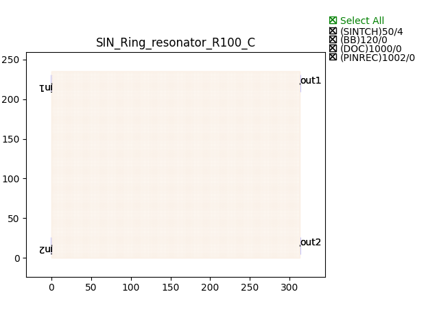

Ring Resonators
#####################

SIN_Ring_resonator_R100_C
********************************

+-------+-----------------------------+-------------+
| ports |     waveguide type          | orientation |
+=======+=============================+=============+
| in1   | TECH.WG.Channel.C.WIRE      |     180     |
+-------+-----------------------------+-------------+
|  in2  | TECH.WG.Channel.C.WIRE      |     180     |
+-------+-----------------------------+-------------+
|  out1 | TECH.WG.Channel.C.WIRE      |     0       |
+-------+-----------------------------+-------------+
|  out2 | TECH.WG.Channel.C.WIRE      |     0       |
+-------+-----------------------------+-------------+

SIN_Ring_resonator_R100_O
********************************
.. image:: ../images/SIN_Ring_resonator_R100_O.png

+-------+-----------------------------+-------------+
| ports |     waveguide type          | orientation |
+=======+=============================+=============+
| in1   | TECH.WG.Channel.O.WIRE      |     180     |
+-------+-----------------------------+-------------+
|  in2  | TECH.WG.Channel.O.WIRE      |     180     |
+-------+-----------------------------+-------------+
|  out1 | TECH.WG.Channel.O.WIRE      |     0       |
+-------+-----------------------------+-------------+
|  out2 | TECH.WG.Channel.O.WIRE      |     0       |
+-------+-----------------------------+-------------+

