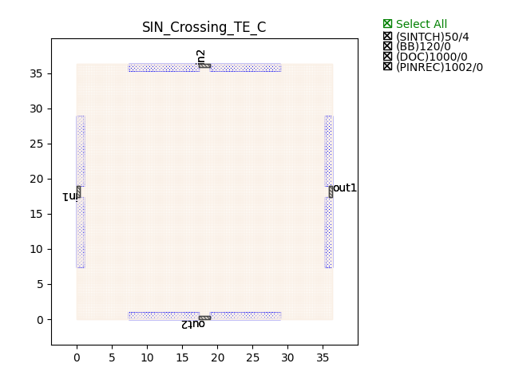
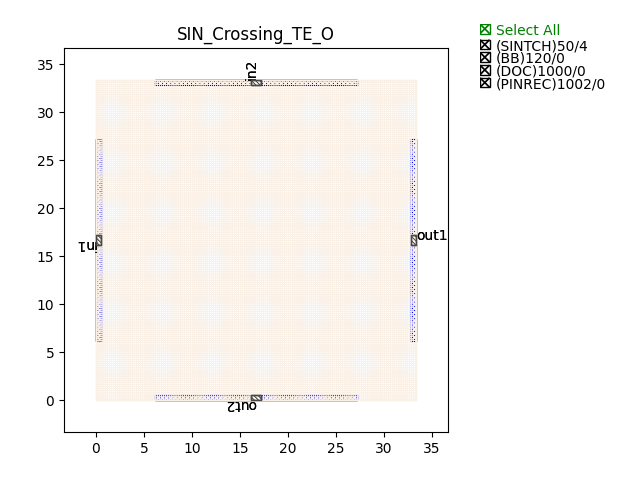

Crossings
###########

SIN_Crossing_TE_C
******************

+-------+------------------------+-------------+
| ports |     waveguide type     | orientation |
+=======+========================+=============+
|  in1  | TECH.WG.Channel.C.WIRE |     180     |
+-------+------------------------+-------------+
|  out2 | TECH.WG.Channel.C.WIRE |      -90    |
+-------+------------------------+-------------+
|  out1 | TECH.WG.Channel.C.WIRE |     0       |
+-------+------------------------+-------------+
|  in2  | TECH.WG.Channel.C.WIRE |      90     |
+-------+------------------------+-------------+

SIN_Crossing_TE_O
******************

+-------+-----------------------------+-------------+
| ports |     waveguide type          | orientation |
+=======+=============================+=============+
|  in1  | TECH.WG.Channel.O.WIRE      |     180     |
+-------+-----------------------------+-------------+
|  out2 | TECH.WG.Channel.O.WIRE      |      -90    |
+-------+-----------------------------+-------------+
|  out1 | TECH.WG.Channel.O.WIRE      |     0       |
+-------+-----------------------------+-------------+
|  in2  | TECH.WG.Channel.O.WIRE      |      90     |
+-------+-----------------------------+-------------+

