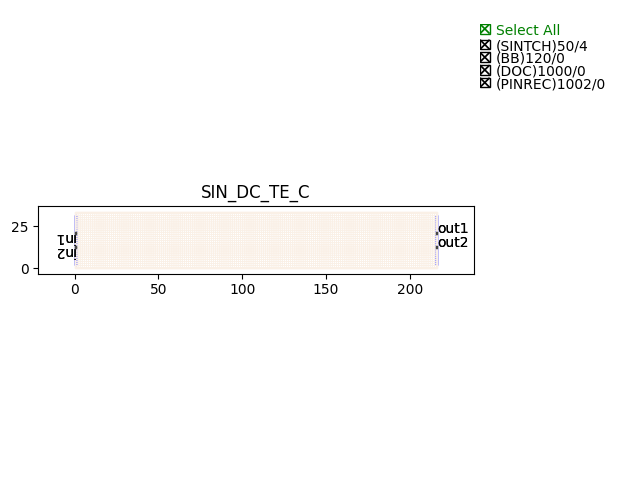

Directional Couplers (DC)
################################

SIN_DC_TE_C
***************

+-------+-----------------------------+-------------+
| ports |     waveguide type          | orientation |
+=======+=============================+=============+
|  in1  | TECH.WG.Channel.C.WIRE      |     180     |
+-------+-----------------------------+-------------+
|  in2  | TECH.WG.Channel.C.WIRE      |      180    |
+-------+-----------------------------+-------------+
| out1  | TECH.WG.Channel.C.WIRE      |     0       |
+-------+-----------------------------+-------------+
| out2  | TECH.WG.Channel.C.WIRE      |      0      |
+-------+-----------------------------+-------------+

SIN_DC_TE_O
******************
.. image:: ../images/SIN_DC_TE_O.png

+-------+-----------------------------+-------------+
| ports |     waveguide type          | orientation |
+=======+=============================+=============+
|  in1  | TECH.WG.Channel.C.WIRE      |     180     |
+-------+-----------------------------+-------------+
|  in2  | TECH.WG.Channel.C.WIRE      |      180    |
+-------+-----------------------------+-------------+
| out1  | TECH.WG.Channel.C.WIRE      |     0       |
+-------+-----------------------------+-------------+
| out2  | TECH.WG.Channel.C.WIRE      |      0      |
+-------+-----------------------------+-------------+

