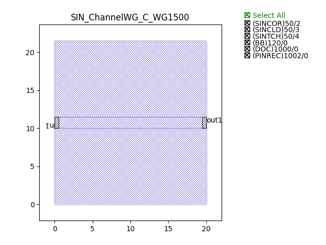
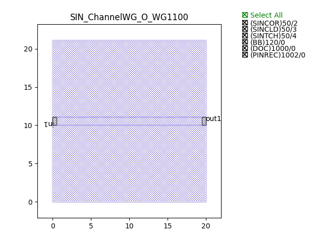

Waveguides
#######################

SIN_ChannelWG_C_WG1500
**********************

+-------+-----------------------------+-------------+
| ports |     waveguide type          | orientation |
+=======+=============================+=============+
| in1   | TECH.WG.Channel.C.WIRE      |     180     |
+-------+-----------------------------+-------------+
|  out1 | TECH.WG.Channel.C.WIRE      |        0    |
+-------+-----------------------------+-------------+

SIN_ChannelWG_O_WG1100
**********************

+-------+-----------------------------+-------------+
| ports |     waveguide type          | orientation |
+=======+=============================+=============+
|  in1  | TECH.WG.Channel.O.WIRE      |     180     |
+-------+-----------------------------+-------------+
|  out1 | TECH.WG.Channel.O.WIRE      |        0    |
+-------+-----------------------------+-------------+

